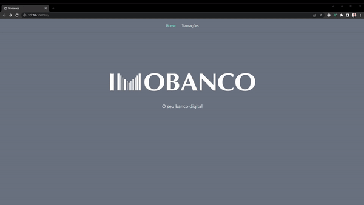

<h1 align="center"> Desafio Imobanco <h1>

<h2>Descrição do projeto:<h2>

Projeto desenvolvido para a realização do teste prático para vaga de Desenvolvedor Front-end Jr da empresa Imobanco.  
O projeto tem o intuito de renderizar em tela uma série de transações realizadas por clientes, e posterior a isso, visualizar as informações de cada cliente e as transações realizadas pelos mesmos.

 

## :hammer: Funcionalidades do projeto

- `Funcionalidade 1`: 
    
Visualização de todas as transações realizadas 

- `Funcionalidade 2`: 
    
Ao clicar em uma das transações, verificar os dados do cliente relacionados a essa transação e também ver todas as transações que o cliente ja fez

## 🛠️ Tecnologias utilizadas

- `VueJS 3` - version: 3.2.37
- `Vite` - version: 3.0.7
- `Tailwind CSS` - version: 3.1.8
- `Vue-axios`- version: 3.4.1
- `Vuex` - version: 4.0.2
- `Vue-router` - version: 4.1.5.
- `Vue-persiste` - version: 3.1.3
- `Node` - version: 16.15.0
- `npm` - version:8.5.5
               
          
          
	
